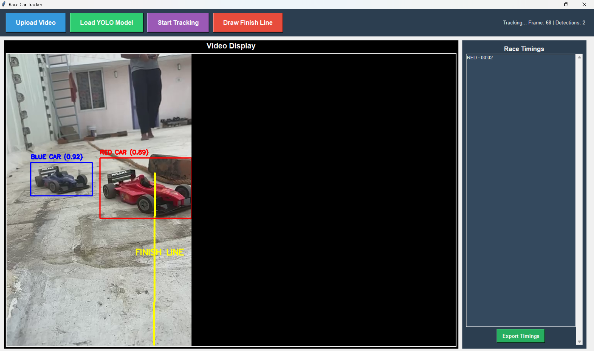

# Race Car Tracker

A YOLO-based real-time object detection and tracking application for monitoring toy race cars crossing a finish line.

## Overview

This project uses YOLOv8 for real-time car detection and tracking, combined with a Tkinter GUI for interactive video analysis. It can track multiple colored cars, detect when they cross a designated finish line, and record lap times.



## Features

- **Real-time Object Detection**: Uses YOLOv8 for accurate car detection
- **Multi-car Tracking**: Simultaneously track multiple cars (red, blue, etc.)
- **Finish Line Detection**: Manually draw a finish line on the video
- **Lap Time Recording**: Automatically records when cars cross the finish line
- **Interactive GUI**: Built with Tkinter for easy video playback control
- **Video Playback**: Frame-by-frame navigation and video seeking
- **Data Export**: Export race timings to file

## Requirements

- Python 3.8+
- See `requirements.txt` for dependencies

## Installation

1. Clone the repository:
```bash
git clone <repository-url>
cd "RaceCar YOLO"
```

2. Create and activate virtual environment:
```bash
python -m venv venv
# Windows
venv\Scripts\Activate.ps1
# macOS/Linux
source venv/bin/activate
```

3. Install dependencies:
```bash
pip install -r requirements.txt
```

## Usage

1. Run the application:
```bash
python main.py
```

2. **Upload Video**: Click "Upload Video" to select a video file
3. **Load YOLO Model**: Click "Load YOLO Model" to load the pre-trained model
4. **Draw Finish Line**: Click "Draw Finish Line" and click two points on the video to define the finish line
5. **Start Tracking**: Click "Start Tracking" to begin detection and tracking
6. **View Results**: Monitor detections and lap times on the right panel
7. **Export Timings**: Click "Export Timings" to save results

## Project Structure

```
RaceCar YOLO/
├── main.py                      # Main application entry point
├── requirements.txt             # Python dependencies
├── data.yaml                    # YOLO dataset configuration
├── extract_frames.py            # Utility to extract frames from videos
├── filter.py                    # Frame filtering utility
├── move.py                      # File management utility
├── rename.py                    # File renaming utility
├── move_unlabeled.py           # Organize unlabeled data
├── yolov8n.pt                  # YOLOv8 nano model (base)
├── best.pt                     # Fine-tuned model weights
├── final.pt                    # Production model weights
└── README.md                   # This file
```

## Models

- **yolov8n.pt**: YOLOv8 Nano - lightweight base model
- **best.pt**: Fine-tuned model on custom car dataset
- **final.pt**: Production-ready model

## Folders (Git-ignored)

- `dataset/` - Training dataset images and labels
- `labeled/` - Manually labeled data
- `frames_unlabeled/` - Unlabeled extracted frames
- `final_dataset_labels_txt/` - Label files
- `cvat_yolo_labels/` - CVAT annotation export
- `25dec/` - Raw video source files
- `runs/` - YOLO training outputs

## Development

### Adding New Features

1. Modify `main.py` for GUI changes
2. Update `requirements.txt` for new dependencies
3. Test with sample videos

### Training Custom Models

Use the `data.yaml` configuration to train custom YOLO models:
```bash
yolo detect train data=data.yaml model=yolov8n.pt epochs=100
```

## License

This project is open source. Feel free to use and modify as needed.

## Notes

- Works best with toy cars on controlled backgrounds
- Adjust confidence thresholds in the code for different lighting conditions
- The finish line detection is manual - draw it carefully for accurate lap timing
